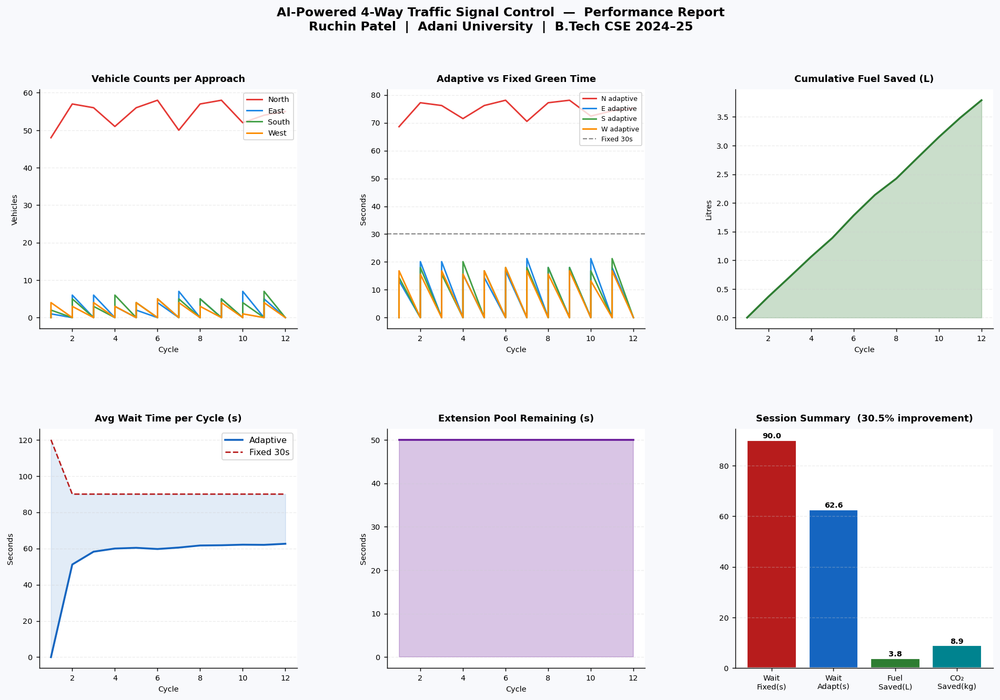

# AI-Based Adaptive Traffic Signal Control System

<div align="center">


**Camera-only adaptive traffic signal controller for Indian four-way intersections.**  
**No buried sensors. No GPU. Runs on a standard laptop.**

[**Demo scenarios**](#demo-scenarios) · [**Quick Start**](#quick-start) · [**How It Works**](#how-it-works) · [**Results**](#results) · [**Research Paper**](#research-paper)

</div>

---

## Table of Contents

- [Overview](#overview)
- [Key Features](#key-features)
- [System Architecture](#system-architecture)
- [How It Works](#how-it-works)
  - [Two-Stage Algorithm](#two-stage-algorithm)
  - [PCU Vehicle Weighting](#pcu-vehicle-weighting)
  - [Tier Table](#tier-table)
  - [Operating Modes](#operating-modes)
- [Project Structure](#project-structure)
- [Quick Start](#quick-start)
  - [Prerequisites](#prerequisites)
  - [Installation](#installation)
  - [Running the System](#running-the-system)
- [Demo Scenarios](#demo-scenarios)
- [Configuration](#configuration)
- [Results](#results)
- [Research Paper](#research-paper)
- [Author](#author)

---

## Overview

Most Indian urban intersections run on **rigid fixed-time signals** — every direction gets the same 30 seconds regardless of actual traffic load. When North has 53 cars and East has 5, both still wait equally. This wastes fuel, increases emissions, and frustrates drivers.

This project replaces fixed timers with a **real-time AI controller** that:

- Uses **overhead cameras** and **YOLOv8-nano** to count and classify vehicles live
- Respects India's **single-green convention** (only one direction gets green at a time: N → E → S → W)
- Allocates green time **proportionally to demand**, weighted by vehicle type (motorcycle vs truck)
- Runs entirely on a **standard laptop CPU** — no GPU, no roadway sensors, no infrastructure changes

Tested against the fixed 30-second baseline, the system achieved:

| Metric | Value |
|--------|-------|
| Weighted vehicle wait reduction | **+31.1%** |
| Fuel saved (26-minute session) | **3.48 L** |
| CO₂ emissions avoided | **8.19 kg** |
| Inference latency (YOLOv8-nano) | **< 34 ms** |
| Peak memory usage | **≈ 448 MB** |

---

## Key Features

- **Camera-Only Detection** — no loop detectors, no radar, no embedded road sensors
- **Two-Stage Adaptive Algorithm** — eliminates positional starvation (Stage 1) and stale-data error (Stage 2)
- **PCU-Weighted Counts** — motorcycles count 0.5×, cars 1.0×, buses 2.5×, trucks 3.0×
- **8-Level Tier Table** — green time mapped from weighted count; calibrated to CRRI 0.83 veh/s discharge rate
- **Extension Pool** — extra 50 seconds available per cycle for genuinely heavy traffic
- **Anti-Starvation Guard** — no direction waits more than 3 full cycles without a green
- **Fallback Safety** — auto-reverts to fixed 30-second intervals if all cameras fail
- **Live OpenCV Dashboard** — 2×2 feed with detection boxes, countdown timers, real-time metrics
- **Auto-Generated Report** — 6-panel PNG performance chart written at session end
- **CSV Session Log** — every cycle's counts, green times, wait metrics and fuel savings recorded
- **6 Built-In Demo Scenarios** — no camera required; runs completely offline

---

## System Architecture

```
┌─────────────────────────────────────────────────────────────────┐
│                    config.py  (single source of truth)          │
└───────────────┬──────────────┬─────────────┬────────────────────┘
                │              │             │
        ┌───────▼──────┐ ┌─────▼──────┐ ┌───▼──────────────────┐
        │  detector.py │ │cycle_manager│ │   simulation.py      │
        │              │ │    .py      │ │  (OpenCV dashboard)  │
        │ 4 threads    │ │             │ │                      │
        │ (N/E/S/W)    │ │ Two-stage   │ │ 2×2 camera feeds     │
        │              │ │ algorithm   │ │ Phase countdowns     │
        │ YOLOv8-nano  │ │ N→E→S→W    │ │ Live metrics bar     │
        │ or demo      │ │ cycle       │ │                      │
        └──────────────┘ └─────────────┘ └──────────────────────┘
                                │
                    ┌───────────▼───────────┐
                    │      utils/           │
                    │  stats.py  (CSV log)  │
                    │  grapher.py (6-panel) │
                    │  demo_traffic.py      │
                    └───────────────────────┘
```

**Module responsibilities:**

| File | Responsibility |
|------|---------------|
| `main.py` | Entry point — wires all modules, runs session, prints summary |
| `config.py` | All tunable parameters in one place (timing, weights, colours, logging) |
| `detector.py` | One thread per direction; YOLOv8-nano inference every 15 frames; falls back to demo |
| `cycle_manager.py` | Two-stage N→E→S→W cycle; manages AI / AI+EXT / FALLBACK states |
| `simulation.py` | OpenCV dashboard with live annotations, timers, and metrics strip |
| `utils/demo_traffic.py` | Synthetic animated road frames and vehicle counts for 6 scenarios |
| `utils/stats.py` | Append-only CSV logger; one row per completed cycle |
| `utils/grapher.py` | Reads CSV and renders the 6-panel PNG performance report |

---

## How It Works

### Two-Stage Algorithm

A naive single-stage proportional controller has two failure modes that this system specifically fixes:

**Problem 1 — Positional starvation:** In a fixed N→E→S→W sequence, if North uses most of the budget, West systematically gets starved — not because of low demand, but because of ordering.

**Problem 2 — Stale data:** Locking in all four green times at cycle start uses counts that are already 60–90 seconds old by the time South or West gets their turn.

The two-stage solution:

```
STAGE 1  (at cycle start — runs once)
─────────────────────────────────────────────
Sample all 4 roads simultaneously.
Compute each road's tier time: T_i = tier(W_i)
Derive proportional budget share:

    share[i] = T_i / Σ T_j  ×  HARD_CAP

This guarantees no road is penalised for position.
Total never exceeds the hard cap (120 + 50 = 170 s).

STAGE 2  (just before each road's green — runs 4× per cycle)
─────────────────────────────────────────────────────────────
Re-sample THIS road's count fresh right now.
Compute fresh tier time from updated count.
Award minimum of (fresh tier time, Stage 1 share cap):

    g[i] = clamp( tier(W_i_fresh), g_min, share[i] )

If queue grew during wait → gets up to its share cap.
If queue cleared → gets less, freeing budget for next cycle.
```

### PCU Vehicle Weighting

Raw vehicle counts don't reflect real clearance time. A truck needs 3× the space and time of a motorcycle. The system converts raw detections into **Passenger Car Unit (PCU) weighted counts**:

```python
VEHICLE_WEIGHT = {
    3: 0.5,   # motorcycle  — small, quick to clear
    2: 1.0,   # car         — baseline unit
    5: 2.5,   # bus         — long, slow acceleration
    7: 3.0,   # truck       — heaviest, widest
}
```

So 10 buses contribute the same pressure as 25 cars. This matches CRRI guidelines for Indian mixed-traffic junctions.

### Tier Table

Weighted counts map to green times through an 8-level tier table, linearly interpolated within each tier to avoid sudden jumps at boundaries:

| Tier | Weighted Vehicles | Green Range | Condition |
|------|-------------------|-------------|-----------|
| 0 | 0 | 10 s (floor) | Empty approach |
| 1 | 1 – 5 | 12 – 18 s | Very light |
| 2 | 6 – 15 | 19 – 30 s | Light |
| 3 | 16 – 25 | 31 – 45 s | Moderate |
| 4 | 26 – 40 | 46 – 60 s | Heavy |
| 5 | 41 – 60 | 61 – 80 s | Very heavy |
| 6 | 61 – 90 | 81 – 110 s | Peak congestion |
| 7 | 91+ | 111 – 120 s | Extreme (+ ext. pool) |

Green time within each tier is interpolated: a count of 30 in Tier 4 (26–40) gives `46 + (30−26)/(40−26) × (60−46) = 50 s`.

### Operating Modes

```
              ┌─────────────────────────────┐
              │         AI MODE             │
              │  Normal two-stage adaptive  │◄──── Start / sensors OK
              └────────────┬────────────────┘
                           │ ΣT_i > CYCLE_BUDGET (120 s)
                           ▼
              ┌─────────────────────────────┐
              │        AI+EXT MODE          │
              │  Extension pool active      │
              │  Total cap: 170 s           │
              └────────────┬────────────────┘
                           │
        Any road = 0 for FALLBACK_TRIGGER (3) consecutive cycles
                           │
                           ▼
              ┌─────────────────────────────┐
              │      FALLBACK MODE          │
              │  Fixed 30 s per direction   │◄──── Auto-recovers
              │  Camera/detector failure    │       when counts return
              └─────────────────────────────┘
```

---

## Project Structure

```
ai_traffic_v8/
│
├── main.py               # Entry point — start here
├── config.py             # ALL parameters (timing, weights, display, logging)
├── detector.py           # YOLOv8 vehicle detection + demo fallback
├── cycle_manager.py      # Two-stage adaptive signal controller
├── simulation.py         # OpenCV live dashboard
├── requirements.txt      # Python dependencies
│
├── utils/
│   ├── __init__.py
│   ├── demo_traffic.py   # Synthetic traffic generator (6 scenarios)
│   ├── stats.py          # CSV session logger
│   └── grapher.py        # 6-panel PNG performance chart
│
└── results/              # Auto-created at runtime
    ├── stats_YYYYMMDD_HHMMSS.csv
    └── results_YYYYMMDD_HHMMSS.png
```

---

## Quick Start

### Prerequisites

- Python **3.10+** (tested on 3.11)
- Windows 10/11 or Ubuntu 20.04+
- No GPU required — runs on CPU only

### Installation

```bash
# 1. Clone the repository
git clone https://github.com/Ruchin0203/AI-Based-Adaptive-Traffic-Signal-Control-System.git
cd AI-Based-Adaptive-Traffic-Signal-Control-System

# 2. (Recommended) Create a virtual environment
python -m venv venv

# Windows
venv\Scripts\activate

# Linux / macOS
source venv/bin/activate

# 3. Install dependencies
pip install -r requirements.txt
```

> **Note:** `ultralytics` (YOLOv8) is optional. If it is not installed, the system automatically falls back to the built-in demo traffic generator — no camera or video file needed.

### Running the System

**Default (one_heavy demo scenario):**
```bash
python main.py
```

**Choose a specific scenario:**
```bash
python main.py --scenario equal
python main.py --scenario one_heavy
python main.py --scenario two_heavy
python main.py --scenario three_heavy
python main.py --scenario dynamic
python main.py --scenario rush_hour
```

**Keyboard controls while running:**

| Key | Action |
|-----|--------|
| `P` | Pause / Resume |
| `S` | Switch to next demo scenario |
| `R` | Reset statistics display |
| `Q` or `Esc` | Quit and auto-generate performance report |

**Connect real cameras:** Edit `VIDEO_SOURCES` in `config.py`:

```python
VIDEO_SOURCES = {
    "NORTH": 0,           # USB webcam index
    "EAST":  1,
    "SOUTH": "rtsp://192.168.1.10/stream",   # IP camera RTSP URL
    "WEST":  "path/to/video.mp4",            # video file
}
```

---

## Demo Scenarios

Six scenarios are built in — no camera required:

| Scenario | N / E / S / W (vehicles) | Description |
|----------|--------------------------|-------------|
| `equal` | 25 / 25 / 25 / 25 | Symmetric load — baseline comparison |
| `one_heavy` | **55** / 5 / 5 / 4 | Indian rush-hour: one arterial road dominant |
| `two_heavy` | **45** / 5 / **44** / 5 | Opposing arterials both congested |
| `three_heavy` | **40** / **35** / **38** / 4 | Three heavy arms, one quiet |
| `dynamic` | Sinusoidal variation | Time-varying loads (morning/evening transitions) |
| `rush_hour` | Peak / Off / Rising | Sigmoid demand surge on North + gradual South build-up |

> **Expected behaviour for `equal`:** Near-zero improvement — the algorithm correctly assigns equal time when demand is symmetric, matching the fixed-timer baseline.

---

## Configuration

All parameters live in `config.py`. No other file needs editing for basic tuning:

```python
# ── Timing ────────────────────────────────────────────────────────
CYCLE_BUDGET    = 120   # Total green-time budget per cycle (seconds)
EXTENSION_POOL  = 50    # Bonus seconds for overflow (max cycle = 170 s)
MIN_GREEN       = 10    # Safety floor — every direction always gets this
MAX_GREEN       = 120   # Hard ceiling per phase
YELLOW_TIME     = 3     # Amber interval before RED
ALL_RED_GAP     = 1     # All-red clearance between phases
FALLBACK_GREEN  = 30    # Fixed green per direction when in FALLBACK mode

# ── Vehicle Weighting (COCO class id → PCU weight) ────────────────
VEHICLE_WEIGHT  = {3: 0.5, 2: 1.0, 5: 2.5, 7: 3.0}
#                  ^moto    ^car    ^bus    ^truck

# ── Detection ─────────────────────────────────────────────────────
DETECTION_INTERVAL   = 15    # Run YOLOv8 every N frames (~2 Hz at 15 FPS)
CONFIDENCE_THRESHOLD = 0.40  # Minimum confidence to count a detection

# ── Demo ──────────────────────────────────────────────────────────
DEMO_SCENARIO = "one_heavy"  # Default scenario on startup
```

---

## Results

### Performance Report — One-Heavy Scenario

> North: ~55 vehicles · East/South/West: ~5 vehicles · 12 cycles



*Top row (left → right):* Vehicle counts per approach over time · Adaptive vs fixed 30-second green time · Cumulative fuel saved  
*Bottom row:* Average weighted wait comparison · Extension pool utilisation · Session summary bar chart

### Multi-Scenario Expected Performance

| Scenario | Vehicle Counts N/E/S/W | Expected Wait Reduction |
|----------|------------------------|------------------------|
| Equal | 25 / 25 / 25 / 25 | ~0% (symmetric demand) |
| One-Heavy | 55 / 5 / 5 / 5 | +28 – 34% |
| Two-Heavy | 45 / 5 / 44 / 5 | +16 – 24% |
| Three-Heavy | 40 / 35 / 38 / 4 | +10 – 18% |
| Dynamic | Sinusoidal | +18 – 28% |
| Rush Hour | Peak / Off / Rising | +22 – 32% |

> Performance gain approaches zero for symmetric loads — the algorithm correctly identifies when fixed timing is already near-optimal.

### Computational Performance

| Metric | Value |
|--------|-------|
| Inference time per frame | < 34 ms (Ryzen R5, CPU only) |
| Concurrent camera threads | 4 × YOLOv8-nano at ~15 FPS |
| Peak RAM usage | ≈ 448 MB |
| GPU required | ❌ None |
| Buried sensors required | ❌ None |

---

## Research Paper

This project produced a peer-reviewed publication:

> **Adaptive Traffic Signal Control at Four-Way Intersections Using YOLOv8 Vehicle Detection: A Two-Stage Proportional Allocation Approach for Indian Urban Road Conditions**  
> Ruchinkumar Hiteshbhai Patel, Anubhava Srivastava  
> Adani University, Ahmedabad, Gujarat, India  
>
> 📄 *18th IEEE International Conference on Computational Intelligence and Communication Networks (CICN) 2026*  
> 🏛️ Women's University, Manila, Philippines · June 11–14, 2026  
> 🔖 Paper ID: #1571278359 · Status: **Accepted for Oral Presentation**  
> 📚 To be indexed by IEEE Xplore, Scopus, EI Compendex, ISI Proceedings

---

## Author

<table>
  <tr>
    <td><strong>Student</strong></td>
    <td>Ruchinkumar Hiteshbhai Patel</td>
  </tr>
  <tr>
    <td><strong>Enrollment</strong></td>
    <td>1AUA22BCS037</td>
  </tr>
  <tr>
    <td><strong>Degree</strong></td>
    <td>B.Tech Computer Science &amp; Engineering (AI-ML)</td>
  </tr>
  <tr>
    <td><strong>Institution</strong></td>
    <td>Adani University, Ahmedabad, Gujarat, India</td>
  </tr>
  <tr>
    <td><strong>Supervisor</strong></td>
    <td>Dr. Anubhava Srivastava</td>
  </tr>
  <tr>
    <td><strong>GitHub</strong></td>
    <td><a href="https://github.com/Ruchin0203">@Ruchin0203</a></td>
  </tr>
</table>

---

## License

This project is released under the [MIT License](LICENSE).

---

<div align="center">

Made with ❤️ at **Adani University, Ahmedabad** · B.Tech CSE (AI-ML) 2025-26

⭐ If this project helped you, please consider giving it a star!

</div>
